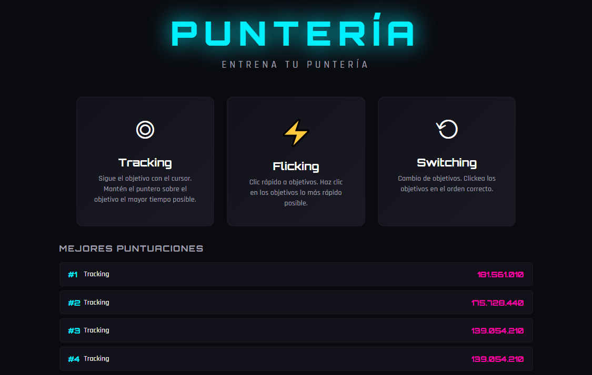

# Aim Trainer Web

Aplicación web para entrenar puntería, inspirada en Aim Lab. Diseñada para mejorar tu rendimiento en juegos FPS como CS2, Valorant y otros shooters.


## 🎮 Modos de Juego

### Tracking
Sigue el objetivo móvil con el cursor. Mantén el puntero sobre el objetivo el mayor tiempo posible mientras se mueve por la pantalla.

- Duración: 30 segundos
- Métrica principal: Porcentaje de tiempo sobre el objetivo

### Flicking
Clic rápido a objetivos que aparecen en posiciones aleatorias. Entrena tu velocidad de puntería y reacción.

- Duración: 20 segundos
- 10 objetivos por ronda
- Métrica principal: Tiempo de reacción promedio

### Switching
Clickea objetivos en el orden correcto. El objetivo activo cambia según el color/tamaño, debes acertar en la secuencia correcta.

- Duración: 25 segundos
- 8 objetivos por ronda
- Métrica principal: Precisión y tiempo de reacción

## 📊 Sistema de Puntuación

- **Puntuación Base**: 100 puntos por acierto
- **Multiplicador de Combo**: +10% por cada acierto consecutivo
- **Bonus de Precisión**: Hasta 50% adicional basado en tu exactitud
- **Persistencia**: High scores guardados en localStorage
- **Historial**: Las últimas 100 puntuaciones se almacenan

### Métricas por Sesión
- Precisión (%)
- Puntuación total
- Aciertos / Fallos
- Tiempo de reacción promedio
- Combo máximo

## Screenshot



## 🎨 Características Visuales

- **Estilo Futurista**: Tema dark con acentos neon (cyan, magenta, verde)
- **Tipografía**: Orbitron + Rajdhani
- **Crosshair Personalizado**: SVG dinámico que sigue el cursor
- **Partículas**: Efectos de impacto al acertar objetivos
- **Grid de Fondo**: Grid sutil para referencia espacial
- **Targets Animados**: Efecto pulse en objetivos con cambio de tamaño

## 🕹️ Controles

| Acción | Control |
|--------|---------|
| Apuntar | Ratón |
| Disparar | Clic izquierdo |
| Pausar | Tecla `ESC` |

## 📁 Estructura del Proyecto

```
simulador-punteria/
├── index.html          # Punto de entrada único
├── css/
│   └── styles.css      # Estilos globales y componentes
├── js/
│   ├── game.js         # Clase Game principal y game loop
│   ├── modes.js        # Lógica de modos y clase Target
│   ├── score.js        # Sistema de puntuación y localStorage
│   └── ui.js           # Gestión de interfaz y transiciones
└── assets/             # Recursos futuros (sprites, modelos)
```

## 🚀 Cómo Usar

1. Abre `index.html` en cualquier navegador moderno
2. Selecciona un modo de juego desde el menú principal
3. Juega y entrena tu puntería
4. Consulta tus resultados al finalizar
5. Revisa el leaderboard con tus mejores puntuaciones

## 🔧 Requisitos Técnicos

- Navegador moderno con soporte ES6+
- Canvas HTML5
- localStorage para persistencia de scores
- Sin dependencias externas (excepto Google Fonts)

## 📈 Próximas Funcionalidades

- [ ] Modelos 3D de armas
- [ ] Modo de juego adicional (Click Timing)
- [ ] Configuración de dificultad
- [ ] Estadísticas detalladas por modo
- [ ] Exportar/importar datos de puntuaciones
- [ ] Modo competitivo con ranking online
- [ ] Efectos de sonido y música

## 📜 Licencia

MIT License - Libre para uso y modificación.
